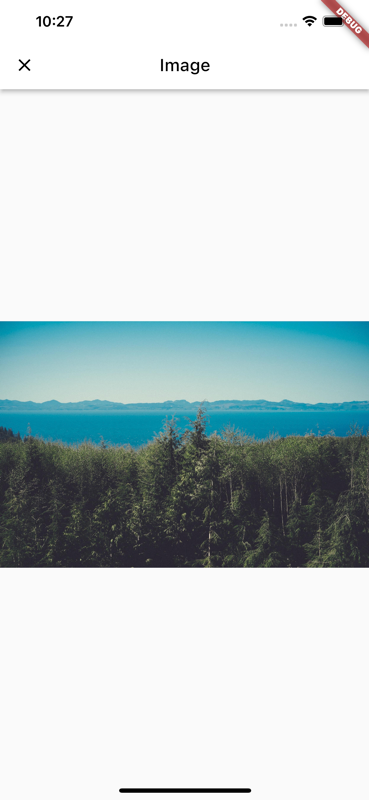

# image_gallery_app

A grid view app that shows images from https://picsum.photos/



<br/>

A loading indicator is shown when scrolling to the bottom of the page and a new request is sent to the server to load more images.

## Notes

### Animations

Page route and hero transitions are used between the GridView and full screen image page.

### Infinite scrolling

To implement infinite scrolling, the `GalleryGrid` is a stateful widget that tracks the scrolling position and when it reaches the end adds an event to the `GalleryBloc` to fetch more images.

The `GalleryGrid` is implemented using a `SliverGrid` inside of a `CustomScrollView` and a circular progress indicator is position below the `SliverGrid`.

Currently the circular progress indicator is always rendered but only visible when scrolling to the end of the list.

When the API calls are successful more images are loaded to the end of the grid view.

When the API calls are unsuccessful (offline) a snack bar is shown after 60 seconds which is the default request timeout of the `http` package. However I've noticed that attempting to scroll when the device is back online and after an unsuccessful API call (during infinite scrolling) does not load more images which is not expected. I will look into that issue as I'm not entirely sure why it happens currently.

### Image caching

The `cached_network_image` package is used to cache images.

### Request caching

The `main` branch doesn't contain any request caching.

But I got started with adding request caching on another branch and the diff can be seen on:

[https://github.com/jamesnocentini/image_gallery_app/compare/main...request-caching](https://github.com/jamesnocentini/image_gallery_app/compare/main...request-caching)

### Http client

The `http` package is used for networking with the Picsum API.

I don't seem to have found an easy way to set the request timeout which could have been helpful for testing connection errors towards the end of the project. I will look into updating the project to use the Dio client.

### Foot note

Output from `tree -d`:

```bash
lib
├── core
│   ├── animations
│   │   └── page_route_transitions.dart
│   ├── exceptions
│   │   ├── exceptions.dart
│   │   └── failures.dart
│   ├── network
│   │   └── http_client.dart
│   └── styles
│       └── app_colors.dart
├── features
│   ├── gallery
│   │   ├── data
│   │   │   ├── datasources
│   │   │   │   └── gallery_remote_data_source.dart
│   │   │   ├── models
│   │   │   │   ├── gallery_model
│   │   │   │   │   ├── gallery_model.dart
│   │   │   │   │   ├── gallery_model.freezed.dart
│   │   │   │   │   └── gallery_model.g.dart
│   │   │   │   └── image_model
│   │   │   │       ├── image_model.dart
│   │   │   │       ├── image_model.freezed.dart
│   │   │   │       └── image_model.g.dart
│   │   │   └── repositories
│   │   │       └── gallery_repository_impl.dart
│   │   ├── domain
│   │   │   └── repositories
│   │   │       └── gallery_repository.dart
│   │   └── presentation
│   │       ├── bloc
│   │       │   ├── gallery_bloc.dart
│   │       │   ├── gallery_bloc.freezed.dart
│   │       │   ├── gallery_event.dart
│   │       │   └── gallery_state.dart
│   │       ├── gallery
│   │       │   └── gallery_page.dart
│   │       └── widgets
│   │           └── gallery_grid.dart
│   └── image
│       └── presentation
│           └── image
│               └── image_page.dart
├── injection_container.dart
└── main.dart
```